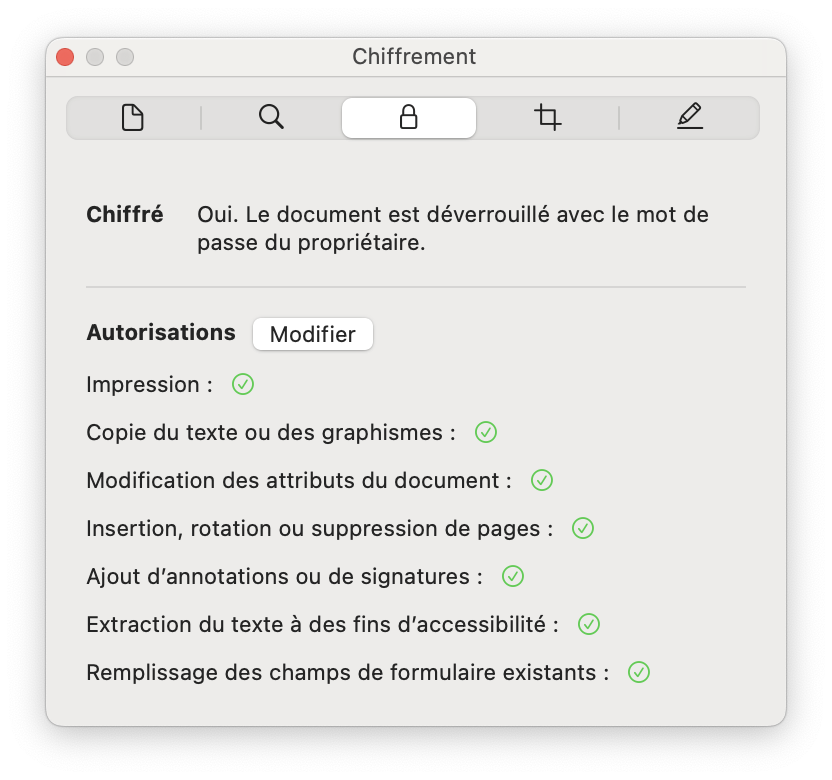
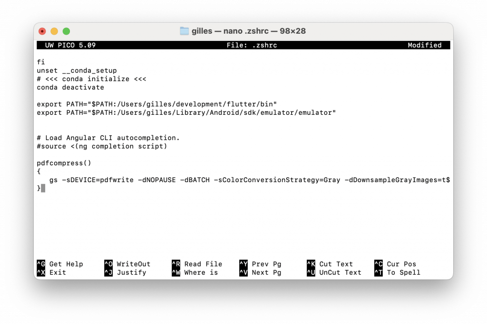

<h1>Manipulation des fichiers PDF</h1>

Les fichiers Adobe PDF sont devenus une norme pour les échanges de documents. Ces fichiers peuvent avoir un poids en octets conséquent notamment en raison de la présence d'images. S'il existe des solutions pour transmettre des fichiers lourds (<a href="https://wetransfer.com/">WeTransfer</a> par ex.) il peut s'avérer judicieux de réduire leur taille. Nous pouvons aussi avoir besoin de modifier les métadatas ou de joindre plusieurs fichiers ensembles. Pour cela nous disposons de nombreuses solutions. Celles que nous allons étudier reposent sur **Ghostscript** (logiciel gratuit) à partir d'un Terminal (bash, zsh, Powershell, etc.) soit à l'aide du code **Python**.

* <a href="#utilisation-dans-le-terminal">Utilisation dans le terminal</a>
    * <a href="#terminal-installation">Installation</a>
        * <a href="#terminal-installation-windows">Windows</a>
        * <a href="http://terminal-installation-macos">MacOS</a>
        * <a href="http://terminal-installation-linux">Linux</a>
    * <a href="#options">Options</a>
    * <a href="#afficher-les-pdf">Afficher un PDF</a>
    * <a href="#obtenir-des-informations">Obtenir des informations</a>
    * <a href="#modifier-les-metadatas">Modifier les métadatas</a>
    * <a href="#deverrouiller-un-pdf">Déverrouiller à l'ouverture</a>
    * <a href="#proteger">Protéger le document</a> 
    * <a href="#joindre-plusieurs-fichiers">Joindre plusieurs fichiers</a>
    * <a href="#convertir-en-pdf-A">Convertir en PDF/A</a>
    * <a href="#orientation">Orientation</a>
    * <a href="#redimensionnement">Redimensionnement</a>
    * <a href="#reduction-de-la-taille-des-documents">Réduction de la taille des documents</a>
        * <a href="#profile-distiller">Profile Distiller</a>
        * <a href="#niveaux-de-gris">Niveaux de gris</a>
        * <a href="#noir-et-blanc">Noir et blanc</a>
    * <a href="#ocr">Reconnaissance de caractères</a>
* <a href="#automatisation">Automatisation</a>
    * <a href="#avec-le-terminal">Avec le Terminal</a>
        * <a href="#automatisation-powershell">Windows Powershell</a>
        * <a href="#automatisation-shell-mac">Shell MacOS/Linux</a>
    * <a href="#automatisation-python">Avec Python</a>
* <a href="#compiler-les-sources">Compiler les sources</a>
    * <a href="#archive-tar">Archive TAR</a>
    * <a href="#depot-distant">Dépôt distant</a>
    * <a href="#ms-visual-studio-code-2022">Windows</a>

<h2 id="utilisation-dans-le-terminal">Utilisation dans le terminal</h2>

Nous allons commencer par installer **Ghostscript** avant de voir les différents usages.

<h3 id="terminal-installation">Installation</h3>

<h4 id="terminal-installation-windows">Windows</h4>

Nous installons **Ghostscript** à partir de la page de <a href="https://www.ghostscript.com/releases/gsdnld.html">téléchargement</a>. Sous Windows 11 nous choisissons la version 64 bit.

La version est installée dans le dossier `C:\Program Files\gs`. A l'intérieur un sous-repertoire pour la version installée. Par exemple, un sous-répertoire `gs10.02.1`.

Dans un sous-répertoire `bin`, nous avons deux exécutables :

* `gswin64.exe` qui ouvre **Ghostscript** dans une fenêtre
* `gswin64c.exe` qui ouvre **Ghostscript** dans le terminal


Par exemple pour ouvrir **Ghostscript** dans **Powershell** nous utiliserons un de ces exécutables.

```powershell
PS C:\Users\gilles> & 'C:\Program Files\gs\gs10.00.0\bin\gswin64c.exe'
GPL Ghostscript 10.0.0 (2022-09-21)
Copyright (C) 2022 Artifex Software, Inc. All rights reserved.
This software is supplied under the GNU AGPLv3 and comes with NO WARRANTY:
see the file COPYING for details.
GS>
```

> Pour une utilisation avec **PowerShell** il conviendra de prendre garde à la syntaxe. Par exemple pour le paramètre `CompatibilityLevel` nous écrirons `-dCompatibilityLevel='1.4'` ou `-dCompatibilityLevel=1.4`.

<h4 id="terminal-installation-macos">macOS</h4>

Pour installer **Ghostscript** dans sur **macOS** nous allons passer par le gestionnaire de package <a href="https://brew.sh/index_fr" target="_blank" rel="noreferrer noopener">brew</a>

```bash
% brew update
% brew upgrade
% brew install ghostscript
% brew brew cleanup
```

La mise à jour de **Ghostscript** se fait avec le paramètre `upgrade`.

```bash
% brew upgrade ghostscript
```

> A noter que pour afficher les fichiers PDF avec **Ghostscript** nous devons installer **<a href="https://www.xquartz.org">xquartz</a>** :
>
> ```bash
> % brew install --cask xquartz
> ```

L'exécutable de **Ghostscript** est `gs` Pour connaître la version de **Ghostscript** :

```bash
% gs --version
9.56.1
```

Pour connaître l'emplacement de l'exécutable :

```bash
% which gs
/opt/local/bin/gs
```

Il est possible que le fichier à cet emplacement soit un lien symbolique. Pour vérifier cela nous tapons la ligne de commandes qui suit. Nous constatons que les informations du fichier commence par `l` (*link*). `->` précise l'emplacement de l'exécutable lié et qui sera exécuté.

```bash
% ls -la /opt/local/bin/gs
lrwxr-xr-x 1 root wheel 47 15 déc 11:07 /opt/local/bin/gs -> /opt/homebrew/Cellar/ghostscript/10.02.1/bin/gs
```

Nous pouvons constater que par exemple la dernière version est installée par **brew** dans le dossier `/opt/homebrew/Cellar/ghostscript`. A l'intérieur de cet emplacement nous avons un répertoire par version de ghostscript. Par exemple, nous avons un répertoire 10.01.2. A l'intérieur un sous-répertoire `bin` avec l'exécutable `gs` (pour **Ghostscript**).

```bash
% /opt/homebrew/Cellar/ghostscript/10.01.2/bin/gs
GPL Ghostscript 10.01.2 (2023-06-21)
Copyright (C) 2023 Artifex Software, Inc. All rights reserved.
This software is supplied under the GNU AGPLv3 and comes with NO WARRANTY:
see the file COPYING for details.
```

Nous pouvons créer un lien symbolique vers l'exécutable pour un appel simplifié. Dans notre cas nous utiliserons `ghostscript` pour appeler l'exécutable `gs`. La commande `ln` avec l'option `-s` crée un lien symbolique vers un fichier.

```bash
% sudo rm /opt/local/bin/gs
% sudo ln -s /opt/homebrew/Cellar/ghostscript/10.01.2/bin/gs /opt/local/bin/ghostscript
% which ghostscript
/opt/local/bin/ghostscript
```

<h4 id="terminal-installation-linux">Linux</h4>

En fonction de la distribution utilisée, nous utiliserons les lignes de commandes qui suivent.

<h5>Pour les distributions à base de Debian</h5>

```bash
gilles@debian:~$ sudo apt update
gilles@debian:~$ sudo apt install ghostscript
```

<h5>Pour la distribution Arch Linux</h5>

```bash
[gilles@Archlinux ~]$ sudo pacman -U http://mirror.archlinuxarm.org/aarch64/extra/libpaper-2.1.1-1-aarch64.pkg.tar.xz
[gilles@Archlinux ~]$ sudo pacman -S ghostscript
```

<h5>Pour la distribution Alpine Linux</h5>

```bash
~ $ sudo apk update
~ $ sudo apk add ghostscript
````

<h5>Pour les distributions à base de Fedora</h5>

```bash
$ sudo yum install ghostscript
```

L'exécutable de **Ghostscript** est `gs`.

Pour construire l'application **Ghostscript** à partir des sources, nous procédons comme suit.

* Nous commençons par récupérer un URL valide vers l'archive contant les sources. Pour cela, nous allons sur la page de <a href="https://ghostscript.com/releases/gsdnld.html">téléchargement</a> et nous récupérons le lien (par ex. <a href="https://github.com/ArtifexSoftware/ghostpdl-downloads/releases/download/gs10012/ghostscript-10.01.2.tar.gz" target="_blank" rel="noreferrer noopener">https://github.com/ArtifexSoftware/ghostpdl-downloads/releases/download/gs10012/ghostscript-10.01.2.tar.gz</a>).
* Dans le terminal nous nous déplaçons dans le répertoire de téléchargement ou dans un répertoire temporaire quelconque. Nous allons décompresser dans ce répertoire les sources. Pour télécharger l'archive dans le terminal nous avons à notre disposition la commande `wget`. Si elle n'est pas disponible, tous les gestionnaires de paquets la répertorie dans leurs dépôts (par ex. `sudo apt install wget`).
* Nous dé-archivons le fichier téléchargé. A partir d'un gestionnaire de fenêtres, en double cliquant dessus nous allons pouvoir le faire automatiquement. Dans le terminal nous utiliserons une ligne de commandes pour dé-archiver : `tar -xzf ghostscript-10.01.2.tar.gz`. Un sous répertoire est créé. Les sources sont à l'intérieur
* Nous définissons comme répertoire en cours la racine de ce répertoire. Par ex. `cd ghostscript-10.01.2`
* A l'intérieur, nous exécutons le fichier de configuration `./configure`. Ce fichier va préparer la compilation à partir des données collectés dans le système (architecture par exemple). Un fichier `makefile` est créé.
* Pour lancer la compilation du code nous tapons la commande `make`. Cette opération peut être plus ou moins longue en fonction de la puissance de l'ordinateur.
* Enfin, pour installer le code compilé dans notre système, nous exécuterons en mode super utilisateur la commande `sudo make install`

En résumé, nous pouvons exécuter les commandes suivantes :

```bash
[gilles@Archlinux Downloads]$ wget https://github.com/ArtifexSoftware/ghostpdl-downloads/releases/download/gs10012/ghostscript-10.01.2.tar.gz
[gilles@Archlinux Downloads]$ tar -xzf ghostscript-10.01.2.tar.gz
[gilles@Archlinux Downloads]$ cd ghostscript-10.01.2
[gilles@Archlinux ghostscript-10.01.2]$ ./configure
[gilles@Archlinux ghostscript-10.01.2]$ make
[gilles@Archlinux ghostscript-10.01.2]$ sudo make install
```

<h3 id="options">Options</h3>

*Ghostscript* est une logiciel en ligne de commandes. Par défaut, il va s'exécuter en mode interactif. L'utilisateur doit entrer les commandes à la suite d'un prompt et les valider par appui sur la touche entrée. Pour sortir de ce mode, il faut taper la commande `quit`.

Pour ce qui nous concerne il est plus intéressant de l'utiliser en mode shell, sans interaction. A la suite du nom de la commande **Ghostscript** (par ex. `gs`) nous saisirons une suite de paramètres et d'arguments, ainsi que le nom des fichiers à traiter en entrée et en sortie.

| <div style="width:200px">**Commandes**</div> | **Descriptions** |
| ------------- | :--------------- |
| **gs \-h**                        | Affiche l'aide et la configuration de base, notamment la liste des périphériques disponibles \(device\)\.                                                                                                                                                                                                                                                                                                                                                    |
| **\-q** ou **\-dQUIET**               | Supprime l'affichage des messages de démarrage \(version, copyright\)                                                                                                                                                                                                                                                                                                                                                                                        |
| **\-f**                           | Définir un fichier en entrée                                                                                                                                                                                                                                                                                                                                                                                                                                 |
| **\-d**                           | Affecte une valeur à un paramètre interne\. Cette valeur doit avoir un type de données reconnue par Ghostscript comme par exemple false, true  ou null\. Ce peut être également une valeur numérique\.                                                                                                                                                                                                                                                       |
| **\-s**                           | Affecte sous forme de texte une valeur à un paramètre interne                                                                                                                                                                                                                                                                                                                                                                                                |
| **\-dNODISPLAY**                  | Utilise un périphérique NUL qui ne génère pas de sortie\. Cela remplace le périphérique de sortie par défaut ou défini avec \-sDEVICE=\. A utiliser dans le cas d'une évaluation\.                                                                                                                                                                                                                                                                           |
| **\-dPDFSETTINGS=**               | Profile Adobe Distiller pour traiter le fichier en sortie\. Ils comportent des préréglages en fonction de la destination\. Par ex\. /screen\. Les valeurs possibles sont : \\screen \(résolution basse, optimisé pour les écrans\), \\ebook \(résolution moyenne, optimisé pour livre numérique\), \\printer \(résolution élevée, optimisé pour impression\), \\prepress \(optimisé prepress\) et \\default                                                  |
| **\-sDEVICE=**                    | Défini le périphérique de sortie\. C'est par exemple un fichier Adobe PDF avec pdfwrite\.                                                                                                                                                                                                                                                                                                                                                                    |
| **\-sPAPERSIZE=**                 | Défini les dimensions par défaut des pages\. Par ex\. \-sPAPERSIZE=a4 ou \-sPAPERSIZE=legal                                                                                                                                                                                                                                                                                                                                                                  |
| **\-dFIXEDMEDIA**                 | Fixe les dimensions des médias \(images\) pour les adapter                                                                                                                                                                                                                                                                                                                                                                                                   |
| **\-dPDFFitPage**                 | Ajuste le contenu au dimension de la page                                                                                                                                                                                                                                                                                                                                                                                                                    |
| **\-dDEVICEWIDTHPOINTS=w**        | Définir la largeur d'une page en DPI \(point par pouce, 1 point = 1/72 de pouce \)\. Par exemple                                                                                                                                                                                                                                                                                                                                                             |
| **\-dDEVICEHEIGHTPOINTS=h**       | Définir la hauteur d'une page en DPI \(point par pouce, 1 point = 1/72 de pouce \)\. Par exemple \-dDEVICEHEIGHTPOINTS=300                                                                                                                                                                                                                                                                                                                                   |
| **\-dMonoImageResolution=**       | Résolution en DPI pour les images monochrome\. Par ex\. \-dMonoImageResolution=100                                                                                                                                                                                                                                                                                                                                                                           |
| **\-dColorImageResolution=**      | Résolution en DPI pour les images couleur\. Par ex\. 100                                                                                                                                                                                                                                                                                                                                                                                                     |
| **\-dGrayImageResolution=**       | Résolution en DPI pour les images en niveaux de gris\. Par ex\. 150                                                                                                                                                                                                                                                                                                                                                                                          |
| **\-dDownsampleColorImages=**     | Autorise la modification de la résolution des images couleurs\. true pour autoriser\.                                                                                                                                                                                                                                                                                                                                                                        |
| **\-dColorImageDownsampleType=**  | Défini la méthode de transformation de la résolution des images\. Les valeurs possibles sont : /Subsample, /Average et /Bicubic\.                                                                                                                                                                                                                                                                                                                            |
| **\-dAntiAliasColorImages=**      | Active le traitement anti\-alias des images couleurs\. true pour autoriser\.                                                                                                                                                                                                                                                                                                                                                                                 |
| **\-dDownsampleGrayImages=**      | Autorise la modification de la résolution des images en niveaux de gris\. true pour autoriser\.                                                                                                                                                                                                                                                                                                                                                              |
| **\-dGrayImageDownsampleType=**   | Défini la méthode de transformation de la résolution des images\. Les valeurs possibles sont : /Subsample, /Average et /Bicubic\.                                                                                                                                                                                                                                                                                                                            |
| **\-dAntiAliasGrayImages=**       | Active le traitement anti\-alias des images en niveaux de gris\. true pour autoriser\.                                                                                                                                                                                                                                                                                                                                                                       |
| **\-dDownsampleMonoImages=**      | Autorise la modification de la résolution des images monochromes\. true pour autoriser\.                                                                                                                                                                                                                                                                                                                                                                     |
| **\-dMonoImageDownsampleType=**   | Défini la méthode de transformation de la résolution des images\. Les valeurs possibles sont : /Subsample, /Average et /Bicubic\.                                                                                                                                                                                                                                                                                                                            |
| **\-dAntiAliasMonochromeImages=** | Active le traitement anti\-alias des images en monochrome\. true pour autoriser\.                                                                                                                                                                                                                                                                                                                                                                            |
| **\-dBlackText**                  | Appliquer une couleur noire à tous les contenus textes\. Cela ne concerne pas le texte dans les images\.                                                                                                                                                                                                                                                                                                                                                     |
| **\-dBlackVector**                | Appliquer une couleur noire à tous les contenus vectoriels\.                                                                                                                                                                                                                                                                                                                                                                                                 |
| **\-sOCRLanguage=**               | Définir la langue utilisée pour la reconnaissance de caractères \(OCR\)\. Par ex\. \-sOCRLanguage="fra"\.                                                                                                                                                                                                                                                                                                                                                    |
| **\-dOCREngine=**                 | Choisir le moteur OCR à utiliser \(0 pour Legacy Tesseract et 1 pour LSTM/Neural Network\)\.                                                                                                                                                                                                                                                                                                                                                                 |
| **\-dBATCH**                      | N'ouvre pas la console de Ghostscript et traite directement le ou les fichiers en entrée\. Ghostscript se ferme automatiquement quand toutes les opérations sont terminées\. A utiliser pour l'utilisation dans des scripts                                                                                                                                                                                                                                  |
| **\-dNOPROMPT**                   | En mode interactif, masque l'invite pour saisir de Ghostscript                                                                                                                                                                                                                                                                                                                                                                                               |
| **\-dNOPAUSE**                    | Désactive la pause automatique après chaque page\. Il est utilisé conjointement avec Normalement, on \-dBATCH\.                                                                                                                                                                                                                                                                                                                                              |
| **\-sColorConversionStrategy=**   | Défini la stratégie de conversion des couleurs avec une chaîne de caractères\. Les valeurs possibles sont : LeaveColorUnchanged, Gray, RGB, ou CMYK\.                                                                                                                                                                                                                                                                                                        |
| **\-dColorConversionStrategy=**   | Défini la stratégie de conversion des couleurs\. Les valeurs possibles sont : /LeaveColorUnchanged, /Gray, /RGB, ou /CMYK\.                                                                                                                                                                                                                                                                                                                                  |
| **\-dCompatibilityLevel=**        | Niveau de compatibilité\. Par ex\. 1\.4                                                                                                                                                                                                                                                                                                                                                                                                                      |
| **\-o ou \-sOutputFile=**         | Définir le fichier de sortie avec les options \-dBATCH et \-dNOPAUSE\. Par ex\. \-o out\.pdf ou \-sOutputFile=out\.pdf                                                                                                                                                                                                                                                                                                                                       |
| **\-sCompression=**               | Type de compression None, LZW, Flate, jpeg et RLE                                                                                                                                                                                                                                                                                                                                                                                                            |
| **\-dDetectDuplicateImages=**     | Regroupe en une seule images les images ayant un hashage identique\. La valeur par défaut est à true\.                                                                                                                                                                                                                                                                                                                                                       |
| **\-c "\.\.\."**                  | Définir une commande Postscript et demander à Ghostscript de l'interpréter\.  La  ou les commandes sont placées entre double guillemets\.                                                                                                                                                                                                                                                                                                                    |
| **\-dFirstPage=**                 | Début de la page à traiter\. Par ex\. \-dFirstPage=3 pour ignorer les 2 premières pages                                                                                                                                                                                                                                                                                                                                                                      |
| **\-dLastPage=**                  | Dernière page à traiter\. Par ex\. \-dLastPage=182 pour ignorer les pages après la page 182                                                                                                                                                                                                                                                                                                                                                                  |
| **\-sPageList=**                  | Définir les pages à traiter\. Il peut y avoir trois types de valeurs : odd \(toutes les pages impaires\), even \(toutes les pages paires\) et une liste de pages\. La liste de page peut être formalisée par une liste de numéros de page séparé par une virgule \(par ex\. \-PageList=2,30,42\), une plage de page avec le signe moins \(par ex\.  \-PageList=2\-42\), et une liste de pages et de plages de pages \(par ex\.  \-PageList=2,7,10\-29,40\)\. |
| **\-sOwnerPassword=**             | Définir le mot de passe du propriétaire du document\. Le document peut être ouvert, mais il sera limité aux permissions accordés par le propriétaire \(modification, impression, etc\.\)\.                                                                                                                                                                                                                                                                   |
| **\-sUserPassword=**              | Définir le mot de passe de l'utilisateur lors de l'ouvrir de document\. S'il n'est pas défini, le document peut être ouvert sans mot de passe\. Par contre pour les permissions comme l'impression, il faut le mot de passe du propriétaire \(\-sOwnerPassword=\)\.                                                                                                                                                                                          |
| **\-dEncryptionR=**               | Définir la méthode d'encryptage\. Pour une utilisation avec les versions 1\.4 et suivantes, nous utiliserons gestionnaire de sécurité révision 3 \(\-dEncryptionR=3\)                                                                                                                                                                                                                                                                                        |
| **\-dKeyLength=**                 | Définir la longueur en bits de la clef d'encryption\. Pour la révision 3 du gestionnaire de sécurité est de 128\.                                                                                                                                                                                                                                                                                                                                            |
| **\-dPermissions=**               | Définir sous forme de bit les autorisations PDF \(impression, copie du texte ou des graphiques, insertion, rotation, suppression de pages, ajout d'annotations ou de signatures, remplissage des champs de formulaire\)\. Par ex\. pour n'autoriser que l'impression \-dPermissions=196                                                                                                                                                                      |
| **\-sPDFPassword=**               | Définir le mot de passe pour ouvrir un document protégé\.                                                                                                                                                                                                                                                                                                                                                                                                    |

<h3 id="afficher-les-pdf">Afficher un PDF</h3>

Par exemple, sous Linux, nous indiquons à **Ghostscript** le fichier à afficher.

```bash
[gilles@Archlinux Downloads]$ gs cours-python.pdf

GPL Ghostscript 10.01.2 (2023-06-21)
Copyright (C) 2023 Artifex Software, Inc. All rights reserved.
This software is supplied under the GNU AGPLv3 and comes with NO WARRANTY:
see the file COPYING for details.
Unknown .defaultpapersize: (A4).
Processing pages 1 through 298.

Page 1

>>showpage, press >return> to continue>>
````

<h3 id="obtenir-des-informations">Obtenir des informations</h3>

Pour récupérer les informations disponibles dans un fichier PDF et afficher les métadatas nous procéderons comme suit :

```bash
% gs -dQUIET -dBATCH -dNODISPLAY -dNOPAUSE -dPDFINFO "merge.pdf"

(null) has 15 pages

Title: ??
Author: Gilles
Subject:
Keywords:
Creator: ??
Producer: GPL Ghostscript 9.56.1
CreationDate: D:20230718174033+02'00'
ModDate: D:20230718174033+02'00'
```

La date et l'heure sont définies au format `D:%Y%m%d%H%M%S` ou `D:%Y%m%d%H%M%S%z` (avec prise en compte de la Timezone). Pour convertir une date en utilisant le langage **Python** nous procéderons ainsi :

```python
from datetime import datetime, timezone
from tzlocal import get_localzone

# PDF Date -> date
dateShortPDF=datetime.strptime('D:20230719101359','D:%Y%m%d%H%M%S')
print(dateShortPDF) # -> 2023-07-19 10:13:59

# PDF Date avec Timezone -> date
dateTimezonePDF = datetime.strptime("D:20231226132119+01'00'".replace("'",':')[:-1],'D:%Y%m%d%H%M%S%z')
print(dateTimezonePDF) # -> 2023-12-26 13:21:19+01:00

# date -> PDF Date
dateActuelle=datetime.strftime(datetime.now(), 'D:%Y%m%d%H%M%S')
print(dateActuelle) # -> 'D:20230719101359'

# date -> PDF Date avec TimeZone
dateTimezoneActuelle = datetime.strftime(datetime.now(timezone.utc).astimezone(get_localzone()), 'D:%Y%m%d%H%M%S%z')
dateTimezoneActuelle = f"{dateTimezoneActuelle[:-2]}'{dateTimezoneActuelle[19:]}'"
```

> `tzlocal` est une biblothèque non built-in. Il faut l'importer avec `pip install tzlocal`.

Pour afficher le détail des documents PDF il existe une alternative avec <a href="https://freedesktop.org/wiki/Software/poppler/">Poppler</a>. C'est une bibliothèque open source spécialisée pour les documents PDF.

```bash
% brew install poppler
```

Pour afficher les informations d'un fichier PDF nous passerons son nom en paramètre à `pdfinfo`.

```bash
% pdfinfo "/Users/gilles/Downloads/source.pdf"
Title:
Creator: Adobe Acrobat 22.1
Producer: Adobe Acrobat 22.1 Image Conversion Plug-in
CreationDate: Wed Nov 8 19:01:34 2023 CET
ModDate: Wed Nov 8 19:01:34 2023 CET
Custom Metadata: no
Metadata Stream: yes
Tagged: no
UserProperties: no
Suspects: no
Form: none
JavaScript: no
Pages: 567
Encrypted: no
Page size: 532.8 x 646.08 pts
Page rot: 0
File size: 438948393 bytes
Optimized: yes
PDF version: 1.6
```

Les dimensions de la page (*page size*) sont en points. Il y a 72 points dans un *inch* (dpi ou *dot per inch*) ou 72 pixels dans un inch (ppi ou pixel per inch). Un *inch* (pouce) mesure 2.54 centimètres. 

Pour les convertir nous appliquons la formule suivante : valeur en point multipliée par 1/72 et multipliée par `2.54` pour obtenir une valeur en centimètres. Dans notre exemple, nous évaluons la largeur `532.8` soit `18.796 cm`. La hauteur sera de `22.792 cm`.

$$ largeur = {\text{points} * 2.54\text{ cm} \over 72\text{ dpi}} = {532.9 * 2.54\text{cm} \over 72\text{ dpi}} = 18.796\text{ cm}$$

Pour connaître le détail des images d'un document PDF, nous exécuterons la ligne suivante :

```bash
% pdfimages -list "/Users/gilles/Downloads/source.pdf"

page num type width height color comp bpc enc interp object ID x-ppi y-ppi size ratio
--------------------------------------------------------------------------------------------
1 0 image 2220 2692 rgb 3 8 jpeg no 3564 0 300 300 945K 5.4%
2 1 image 2220 2692 rgb 3 8 jpeg no 4 0 300 300 497K 2.8%
3 2 image 2220 2692 rgb 3 8 jpeg no 8 0 300 300 581K 3.3%
4 3 image 2220 2692 rgb 3 8 jpeg no 12 0 300 300 666K 3.8%
...
```

Dans ce tableau nous identifions la largeur (pixels), hauteur (pixels), mode couleur (RGB ou niveaux de gris) et la densité de points par pouce (*inch*) en largeur (x) et en hauteur (y). Nous pouvons évaluer la largeur et la hauteur d'une image en centimètres :

$$ \text{largeur} = {2220 * 2.54\text{ cm} \over 300\text{ dpi}} = 18.796\text{ cm}$$

$$ \text{hauteur} = {2692 * 2.54\text{ cm} \over 300\text{ dpi}} = 22.792\text{ cm}$$

Pour connaître le nombre de points par pouce à partir d'une largeur en pixels et en centimètres, nous écrirons la formule suivante :

$$ \text{dpi} =  {\text{Nbr pixels} * 2.54\text{ cm} \over \text{longueur en cm}} = {2220\text{ pixels} * 2.54\text{ cm} \over 18.796\text{ cm}} = 300\text{ dpi}$$

Pour connaître le nombre de pixels à partir des DPI et de la longueur en centimètres.

$$ \text{pixels} =  {\text{dpi} * \text{longueur en cm} \over 2.54\text{ cm}} = {300\text{ dpi} * 18.796\text{ cm} \over 2.54\text{ cm}} = 2220\text{ pixels}$$

A partir de ces informations, nous pouvons ajuster un document PDF pour une impression optimale. Par exemple pour imprimer en 300 dpi une page (A4 21 cm x 29.7 cm) avec une image pleine plage, la résolution en pixels sera :

$$ \text{largeur} = {300\text{ dpi}* 21\text{ cm} \over 2.54\text{ cm}} = 2480\text{ pixels}$$ 

$$ \text{hauteur} = {300\text{ dpi}* 29.7\text{ cm} \over 2.54\text{ cm}} = 3508\text{ pixels}$$

> Pour aller plus loin sur le sujet, pour une visualisation optimum sur un écran spécifique (je pense notamment à une liseuse ou une tablette), il faut évaluer la résolution idéale.
>
> Par exemple pour un écran 24" full hd (1920 x 1080) nous aurons une densité de pixels de 92 <a href="https://en.wikipedia.org/wiki/> Pixel_density">PPI</a> (*Pixels per inch*).
>
> $$ \text{ppi} = {\text{largeur en pixels} \over \text{largeur de l'écran en pouce (inch)}} $$
>
> Attention, il s'agit de la largeur d'un écran en pouce, et non pas de la diagonale. Par exemple pour un écran <a href="https://www.> displayspecifications.com/en/model-width/b4452703">Huawei MateView 28.2"</a> nous avons approximativement une largeur de 23.95 pouces pour > une résolution horizontale de 3840 pixels.
>
> $$ \text{ppi} = {3840\text{ pixels} \over 23.95\text{ pouce (inch)}} = 160 \text{ ppi} $$
>
> Pour un liseuse, par exemple une Amazon Kindle Scribe 10.2" (1860x2480 pixels), nous avons une densité de 300 PPI. Pour récupérer la largeur > en pouce, nous appliquerons la formule suivante :
>
> $$ \text{largeur en pouces} = {\text{largeur en pixels} \over \text{ppi}} = {1860\over300} = 6.2 pouces $$
>
> Pour obtenir une longueur en centimètre, nous devons multiplier une valeur en pouces par 2.54 cm.
>
> Ces formules peuvent également servir pour évaluer les dimensions idéales en pixels d'une image pour une impression en 300 dpi sur du papier en 10 x 15 cm :
> 
> $$ \text{largeur en pixels} = { 300 \text{ dpi} * 10 \text{ cm} \over 2.54 \text{ cm} } = 1181 \text{ pixels}$$
> 
> $$ \text{hauteur en pixels} = { 300 \text{ dpi} * 15 \text{ cm} \over 2.54 \text{ cm} } = 1772 \text{ pixels}$$
>
> La résolution en mégapixels de cette image est évaluée avec la formule suivante :
>
> $$ \text{résolution en mpx} = {{1181\text{ pixels} * 1772\text{ pixels}} \over 1000000\text{ pixels}} = 2.10 \text{ mégapixels}$$
> 
> Inversement pour connaître à partir des dimensions en pixels d'une photo, nous pouvons calculer pour une valeur de DPI la dimension d'impression maximale. Par exemple pour un fichier JPEG issu d'un boitier Sony ILCE-7M4 de 33 mpx (7008 × 4672), les dimensions à 200 DPI sont :
>
> $$ \text{largeur en cm} = { 7008 \text{ dpi} * 2.54\text{ cm} \over 200\text{ dpi} } = 89\text{ cm}$$
> 
> $$ \text{hauteur en cm} = { 4672 \text{ dpi} * 2.54\text{ cm} \over 200\text{ dpi} } = 59\text{ cm}$$

<h3 id="modifier-les-metadatas">Modifier les métadatas</h3>

Les métadatas disponibles par défaut sont :

| **Métadatas** | **Descriptions** |
| --- | :--- |
| **/Title** | Titre du document |
| **/Author** | Auteur du document |
| **/Subject** | Sujet ou objet du document |
| **/Keywords** | Mots\-clefs séparés par une virgule |
| **/ModDate** | Date de modification |
| **/Creator** | Créateur |
| **/Producer** | Outil de création du document |
| **/CreationDate** | Date de création |

Le principe pour modifier les métadatas du document est le suivant :

* ajouter le paramètre `-c`
* entre doubles guillemets, nous commençons par `[`
* chaque métadata à modifier est insérée avec la nouvelle valeur placée entre parenthèses.
* avant les doubles guillemets de fin nous ajoutons `/DOCINFO pdfmark`

Par exemple : `-c "[/Title (Mon document PDF) /Producer (Gilles) /DOCINFO pdfmark"`

```bash
% gs -sDEVICE=pdfwrite -dNOPAUSE -dBATCH -sColorConversionStrategy=Gray -dDownsampleGrayImages=true -dGrayImageResolution=150 -sGrayImageDownsampleType=Subsample -dCompatibilityLevel=1.4 -sOutputFile=/Users/gilles/output.pdf /Users/gilles/input.pdf -c "[/Title (Mon document PDF) /Producer (Gilles) /DOCINFO pdfmark"
```

<h3 id="deverrouiller-un-pdf">Déverrouiller</h3>

Un document PDF peut être protégé par un mot de passe en ouverture. Pour récupérer par exemple des informations sur ce fichier, nous devrons transmettre le mot de passe avec `-sPDFPassword=`.

```bash
% gs -dQUIET -dBATCH -dNODISPLAY -dNOPAUSE -sPDFPassword=XXXXXXXX -dPDFINFO "crypte.pdf"

(null) has 2 pages

Title: /var/www/kalilab-tmp/ktag8f9l8f.rtf
Author: Laurent Schlegel
Creator: Ted: http://www.nllgg.nl/Ted
Producer: Ted: http://www.nllgg.nl/Ted
CreationDate: D:202108121018
ModDate: D:202109141311
```

Pour définir un mot de passe à l'ouverture d'un fichier nous utiliserons les options cumulées `-sOwnerPassword=` (mot de passe administrateur pour permettre le contrôle de la lecture) et `-sUserPassword=` (mot de passe qui sera demandé à l'ouverture).

```bash
% gs -sDEVICE=pdfwrite -dNOPAUSE -dBATCH -dCompatibilityLevel=2.0 -sOwnerPassword=test -sUserPassword=mot-de-passe -sOutputFile="/Users/gilles/Downloads/dossier-transforme.pdf" -f "/Users/gilles/Downloads/dossier.pdf"
```

<h3 id="proteger">Protéger</h3>

Les documents PDF peuvent être protégés en lecture, mais il est également possible certaines actions. Il est possible d'interdire l'impression d'un document (même si on peut toujours imprimer une copie d'écran) ou la modification.

Pour les possesseurs de MacOS ces permissions sont visibles dans l'inspecteur (⌘I).

<figure style="text-align:center;"></figure>

Techniquement, pour protéger un document PDF en modulant les permissions en fonction des actions autorisées, nous devons assigner à la variable `Permissions` une valeur sur 32 bits. Cette valeur est le résultat de l'activation ou non des bits. Le 1er bit est à droite.

| **Bits** | **Descriptions** |
| --- | :--- |
| **1\-2** | Mettre à 0 |
| **3** | Autoriser l'impression mettre à 1 |
| **4** | Autoriser les modifications \(insertion, rotation, ou suppression de page\) |
| **5** | Autoriser la copie/extraction non contrôlée par le bit 10 |
| **6** | Autoriser les annotations et le remplissage de formulaire\. Bit 4 défini afin d'autoriser la forme interactive |
| **7\-8** | Mettre à 1 \(bits réservés\) |
| **9** | Autoriser le remplissage des champs de formulaire existants |
| **10** | Autoriser la copie des textes et des graphiques |
| **11** | Mettre à 0 |
| **12** | Pour activer l'impression haute résolution mettre à 1 |
| **13\-32** | Mettre à 0 pour le gestionnaire de sécurité révision 3, sinon à 1 pour la révision 2\. |

Il est possible de construire la valeur à l'aide de Python. Dans le REPL, nous pouvons saisir une valeur binaire (les bits sont précédés des caractères `0b`). Par exemple ici nous allons autoriser tout en activant les bits 3 à 6, ainsi que les bits 9 et 10.

```bash
% python3
Python 3.12.0 (v3.12.0:0fb18b02c8, Oct  2 2023, 09:45:56) [Clang 13.0.0 (clang-1300.0.29.30)] on darwin
Type "help", "copyright", "credits" or "license" for more information.
>>> 0b1111111100
1020
```

Une fois notre valeur définie de permissions, nous devons ajouter un mot de passe propriétaire et définir des paramètres d'encryption. Le mot de passe se définit avec `-sOwnerPassword=`.

```bash
% /opt/local/bin/gs -sDEVICE=pdfwrite -dNOPAUSE -dBATCH -dCompatibilityLevel=2.0 -sOwnerPassword=test -dEncryptionR=3 -dKeyLength=128 -dPermissions=1020 -sOutputFile="/Users/gilles/Downloads/pdf_reduce/0-Dossier vente Aquarelle.pdf" -f "/Users/gilles/Downloads/pdf1/0-Dossier vente Aquarelle.pdf"
```

<h3 id="joindre-plusieurs-fichiers">Joindre plusieurs fichiers</h3>

Nous allons joindre plusieurs fichiers PDF en un seul. Nous en profitons pour convertir toutes les pages en niveau de gris.

```bash
% gs -sDEVICE=pdfwrite -dNOPAUSE -sColorConversionStrategy=Gray -dCompatibilityLevel=1.4 -sOutputFile='merge.pdf' -dBATCH 'source1.pdf' 'source2.pdf' 'source3.pdf'
```

<h3 id="convertir-en-pdf-A">Convertir en PDF/A</h3>

Un document PDF/A (*Portable Document Format Archivable*) est une variante normalisée ISO. Ce type de document a été créé pour réaliser un archivage long et apporter des garanties de conservation. **Ghostscript** propose d'ajouter le paramètre `-dPDFA=1`.

```bash
% gs -dPDFA=1 -sDEVICE=pdfwrite -dNOPAUSE -dBATCH -sColorConversionStrategy=Gray -dDownsampleGrayImages=true -dGrayImageResolution=150 -dGrayImageDownsampleType=/Bicubic -dCompatibilityLevel=1.4 -sOutputFile="/Users/gilles/Downloads/destination.pdf" "/Users/gilles/Downloads/source.pdf"
```

<h3 id="orientation">Orientation</h3>

Une propriété `-dAutoRotatePages=` a pour mission d'activer ou non l'auto-rotation. Si nous lui passons en valeur `/PageByPage` ou `/All`, les pages seront redressées automatiquement, et ce quelque soit l'orientation, de manière à faciliter la lecture. Par contre, cela ne modifiera pas l'orientation de la page. Cela ne joue que sur l'affichage. Pour désactiver l'auto-rotation nous affecterons la valeur `/None`. Dans ce cas la valeur affectée à `setpagedevice` est utilisée.

Pour changer physiquement l'orientation des pages nous devons ajouter du code **Postscript** au document. Pour cela, nous allons utiliser la commande `-c ">>/Orientation {orientation}>> setpagedevice"` avec `{orientation}` représentée par une valeur :

* `0` pour aucune rotation (portrait)
* `1` pour 90° vers en sens inverse des aiguilles d'une montre (*landscape* ou paysage)
* `2` pour 180° (*upside down* ou à l'envers)
* `3` pour 90° dans le sens des aiguilles d'une montre (*seascape*)

```bash
% /opt/local/bin/gs -sDEVICE=pdfwrite -dNOPAUSE -dBATCH -dAutoRotatePages=/None -dCompatibilityLevel=2.0 -sOutputFile="/Users/gilles/Downloads/pdf_reduce/dossier.pdf" -c "<</Orientation 3>> setpagedevice" -f "/Users/gilles/Downloads/pdf/dossier.pdf"
```

L'injection du code **Postscript** doit se faire avant l'importation du fichier source. Le commutateur `-f` doit précéder le fichier source.

<h3 id="redimensionnement">Redimensionnement</h3>

Un document PDF peut comporter des pages de dimensions différentes. Si à l'affichage cela ne pose pas de problème, l'impression d'un document va générer des difficultés. Le bac d'alimentation ne comporte en général qu'un seul format de papier.

Avec **Ghostscript** nous avons deux approches pour redimensionner les pages.

La première consiste à utiliser un format pré-existant comme par exemple le format *A4*. Les formats sont transmis en argument de l'option `-sDEFAULTPAPERSIZE=`.

```bash
% /opt/local/bin/gs -sDEVICE=pdfwrite -dNOPAUSE -dBATCH -sPAPERSIZE=a4 -dFIXEDMEDIA -dPDFFitPage -dCompatibilityLevel=2.0 -sOutputFile="/Users/gilles/Downloads/pdf_reduce/dossier.pdf" "/Users/gilles/Downloads/pdf/dossier.pdf"
```

| **Formats**     | **Largeurs** | **Hauteurs** | **Normes**   |
|-----------------|--------------|--------------|--------------|
| **a0**          |  841         | 1189         | ISO STANDARD |
| **a1**          |  594         |  841         | ISO STANDARD |
| **a2**          |  420         |  594         | ISO STANDARD |
| **a3**          |  297         |  420         | ISO STANDARD |
| **a4**          |  210         |  297         | ISO STANDARD |
| **a4small**     |  210         |  297         | ISO STANDARD |
| **a5**          |  148         |  210         | ISO STANDARD |
| **a6**          |  105         |  148         | ISO STANDARD |
| **a7**          |   74         |  105         | ISO STANDARD |
| **a8**          |   52         |   74         | ISO STANDARD |
| **a9**          |   37         |   52         | ISO STANDARD |
| **a10**         |   26         |   37         | ISO STANDARD |
| **isob0**       | 1000         | 1414         | ISO STANDARD |
| **isob1**       |  707         | 1000         | ISO STANDARD |
| **isob2**       |  500         |  707         | ISO STANDARD |
| **isob3**       |  353         |  500         | ISO STANDARD |
| **isob4**       |  250         |  353         | ISO STANDARD |
| **isob5**       |  176         |  250         | ISO STANDARD |
| **isob6**       |  125         |  176         | ISO STANDARD |
| **c0**          |  917         | 1297         | ISO STANDARD |
| **c1**          |  648         |  917         | ISO STANDARD |
| **c2**          |  458         |  648         | ISO STANDARD |
| **c3**          |  324         |  458         | ISO STANDARD |
| **c4**          |  229         |  324         | ISO STANDARD |
| **c5**          |  162         |  229         | ISO STANDARD |
| **c6**          |  114         |  162         | ISO STANDARD |
| **11x17**       | 279          | 432          | US STANDARD  |
| **ledger**      | 432          | 279          | US STANDARD  |
| **legal**       | 216          | 356          | US STANDARD  |
| **letter**      | 216          | 279          | US STANDARD  |
| **lettersmall** | 216          | 279          | US STANDARD  |
| **archE**       | 914          | 1219         | US STANDARD  |
| **archD**       | 610          | 914          | US STANDARD  |
| **archC**       | 457          | 610          | US STANDARD  |
| **archB**       | 305          | 457          | US STANDARD  |
| **archA**       | 229          | 305          | US STANDARD  |
| **jisb0**       | 1030         | 1456         | JIS STANDARD |
| **jisb1**       | 728          | 1030         | JIS STANDARD |
| **jisb2**       | 515          | 728          | JIS STANDARD |
| **jisb3**       | 364          | 515          | JIS STANDARD |
| **jisb4**       | 257          | 364          | JIS STANDARD |
| **jisb5**       | 182          | 257          | JIS STANDARD |
| **jisb6**       | 128          | 182          | JIS STANDARD |
| **flsa**        | 216          | 330          | Autres       |
| **flse**        | 216          | 330          | Autres       |
| **halfletter**  | 140          | 216          | Autres       |
| **hagaki**      | 100          | 148          | Autres       |

La deuxième approche consiste à définir les dimensions en utilisant les options `-dDEVICEWIDTHPOINTS=<largeur>` et `-dDEVICEHEIGHTPOINTS=<hauteur>`. Les dimensions sont en points (1 pouce/inch = 72 points et 1 pouce/inch = 2.54 centimètres). Par exemple, pour appliquer un format de page de 10 x 10 cm nous pour vous exécuter la commande qui suit :

```bash
% /opt/local/bin/gs -sDEVICE=pdfwrite -dNOPAUSE -dBATCH -dDEVICEWIDTHPOINTS=283.46 -dDEVICEHEIGHTPOINTS=283.46 -dFIXEDMEDIA -dPDFFitPage -dCompatibilityLevel=2.0 -sOutputFile="/Users/gilles/Downloads/pdf_reduce/dossier.pdf" "/Users/gilles/Downloads/pdf/dossier.pdf"
```

$$ largeur = {10 \text{ cm} * 72 \text{ points} \over 2.54\text{ cm}} = 283.46\text{ points}$$

Il faut pas oublier d'ajouter les options `-dFIXEDMEDIA -dPDFFitPage` pour adapter les pages au format.

<h3 id="reduction-de-la-taille-des-documents">Réduction de la taille des documents</h3>

<h4 id="profile-distiller">Profile Distiller</h4>

L'utilisation de profiles inspirés d'**Adobe Distiller** est une approche simple pour réduire le poids d'un document. Ces profiles utilisent des réglages adaptés en fonction de l'appareil qui affichera le PDF.

Pour afficher la liste des profiles supportés par l'option `-dPDFSETTINGS=...` nous utiliserons la commande suivante sous macOS ou Linux :

```bash
% gs -dNODISPLAY -c ".distillersettings {exch ==only ( ) print ==} forall quit"
GPL Ghostscript 10.02.1 (2023-11-01)
Copyright (C) 2023 Artifex Software, Inc.  All rights reserved.
This software is supplied under the GNU AGPLv3 and comes with NO WARRANTY:
see the file COPYING for details.
/ebook -dict-
/printer -dict-
/default -dict-
/prepress -dict-
/screen -dict-
/PSL2Printer -dict-
```

Sous Windows, dans **Powershell** nous utiliserons la même commande.

```powershell
PS C:\Users\gille> & 'C:\Program Files\gs\gs10.00.0\bin\gswin64c.exe' -dNODISPLAY -c ".distillersettings {exch ==only ( ) print ==} forall quit"
GPL Ghostscript 10.0.0 (2022-09-21)
Copyright (C) 2022 Artifex Software, Inc. All rights reserved.
This software is supplied under the GNU AGPLv3 and comes with NO WARRANTY:
see the file COPYING for details.
/default -dict-
/prepress -dict-
/screen -dict-
/PSL2Printer -dict-
/ebook -dict-
/printer -dict-
```

Pour afficher les paramètres par défaut d'un profile comme par exemple `/screen` :

```bash
% gs -q -dNODISPLAY -c ".distillersettings /screen get {exch ==only ( ) print ===} forall quit" | sort
/AutoRotatePages /PageByPage
/CannotEmbedFontPolicy /Warning
/ColorACSImageDict << /ColorTransform 1 /Blend 1 /HSamples [2 1 1 2] /VSamples [2 1 1 2] /QFactor 0.76 >>
/ColorConversionStrategy /sRGB
/ColorImageDownsampleType /Average
/ColorImageResolution 72
/CompatibilityLevel 1.5
/CreateJobTicket false
/DoThumbnails false
/EmbedAllFonts true
/GrayACSImageDict << /ColorTransform 1 /Blend 1 /HSamples [2 1 1 2] /VSamples [2 1 1 2] /QFactor 0.76 >>
/GrayImageDownsampleType /Average
/GrayImageResolution 72
/MonoImageDownsampleType /Subsample
/MonoImageResolution 300
/NeverEmbed [/Courier /Courier-Bold /Courier-Oblique /Courier-BoldOblique /Helvetica /Helvetica-Bold /Helvetica-Oblique /Helvetica-BoldOblique /Times-Roman /Times-Bold /Times-Italic /Times-BoldItalic /Symbol /ZapfDingbats]
/PreserveEPSInfo false
/PreserveOPIComments false
/PreserveOverprintSettings false
/UCRandBGInfo /Remove
```

A la suite d'un paramètre de sortie (ici `screen`) nous pouvons modifier certains paramètres comme la résolution de sortie pour les images (ici pour les images monochrome, niveau de gris et couleur).

```bash
% gs -dPDFSETTINGS=/screen -sDEVICE=pdfwrite -dMonoImageResolution=150
-dColorImageResolution=100 -dGrayImageResolution=150
-dBATCH -dNOPROMPT -dNOPAUSE -sOutputFile="/Users/gilles/Documents/Archives/temporaire/pdf-out.pdf" "/Users/gilles/Documents/Archives/temporaire/pdf-in.pdf"
```

<h4 id="niveaux-de-gris">Niveaux de gris</h4>

Pour réduire le poids d'un document, une approche consiste à transformer toutes les images en niveaux de gris. En effet, une image avec cette colorimétrie utilise 256 niveaux de gris. Le nombre d'informations stockées pour une image sera réduit.

Nous personnaliserons la ligne de commandes pour forcer ce type de conversion.

* `-sColorConversionStrategy=Gray` pour appliquer une conversion vers du niveaux de gris à toutes les images.
* `-dGrayImageResolution=100` pour modifier la densité de points par pouce (DPI ou nombre de points imprimés sur une ligne). Un pouce (inch) est égale à 2.54 cm. Une image de 10 cm x 5 cm aura pour une densité de 200 dpi aura environ 787 points en largeur (10 cm / 2.54 x 200 dpi). Plus la résolution en DPI est élevée, plus l'image sera volumineuse. A contrario, une résolution faible allégera le poids de l'image avec en contre-partie une détérioration de la qualité.
* `-dDownsampleGrayImages=true` pour activer le changement de résolution.

Pour réduire la taille de l'image nous allons jouer sur le nombre de DPI.

```bash
% gs -sDEVICE=pdfwrite -dNOPAUSE -dBATCH -sColorConversionStrategy=Gray -dDownsampleGrayImages=true -dGrayImageResolution=100 -dCompatibilityLevel=1.4 -sOutputFile="/Users/gilles/Downloads/destination.pdf" "/Users/gilles/Downloads/source.pdf"
```

Pour les utilisateurs de MacOS (et Linux) il est toujours possible d'intégrer une commande au shell. Avec le shell **ZSH** nous nous plaçons à la racine de l'utilisateur, et nous ouvrons le fichier `.zshrc` (pour **Bash** nous éditerons `.bash_profile`).

```bash
% cd
% nano .zshrc
```

<figure style="text-align:center;"></figure>

Nous ajoutons ensuite le code suivant à la fin du fichier. Pour sauvegarder nous appuyons sur les touches `CTRL+X` puis `Y` et entrée.

```bash
pdfcompress()
{
   gs -sDEVICE=pdfwrite -dNOPAUSE -dBATCH -sColorConversionStrategy=Gray -dDownsampleGrayImages=true -dGrayImageResolution=100 -dCompatibilityLevel=2.0 -sOutputFile=${1%.*}_reduce.pdf $1
}
```

Pour essayer, nous ouvrons un nouveau Terminal. Nous tapons simplement `pdfcompress` suivi du nom du fichier à compresser.

<h3 id="noir-et-blanc">Noir et blanc</h3>

Pour des documents PDF ne comportant que des objets textes, il est possible de forcer les couleurs au noir avec `-dBlackText`. Cela n'affectera pas les images.

```bash
% gs -sDEVICE=pdfwrite -dNOPAUSE -dBATCH -dBlackText -dBlackVector -dCompatibilityLevel=2.0 -sOutputFile="/Users/gilles/Downloads/test-nb.pdf" -f "/Users/gilles/Downloads/test.pdf"
```

<h3 id="ocr">Reconnaissance de caractères (OCR)</h3>

**Ghostscript** intègre depuis la version 9.54 un moteur de reconnaissance de caractères basé sur <a href="https://github.com/tesseract-ocr/tesseract">Tesseract</a> et <a href="http://www.leptonica.org/">Leptonica</a>.  La reconnaissance se fait sur des médias images (par exemple issues d'un scanner).

La reconnaissance est intégrée sous forme de devices :

* `ocr` pour une conversion d'un fichier PDF vers un fichier texte. Les images sont convertis en niveaux de gris pour être analysées par **Tesseract**. Le fichier texte est encodé en UTF-8.
* `hocr` pour une conversion d'un fichier PDF vers un fichier XML au standard <a href="https://en.wikipedia.org/wiki/HOCR">hOCR</a>
* `pdfocr24` (RGB), `pdfocr32` (CMYK) ou `pdfocr8` (niveau de gris) pour une conversion d'un fichier PDF vers un fichier PDF sans modifier le fichier source. Les images sont conservées comme tel. Le texte reconnu est ajouté au fichier. Il ne sera pas disponible à l'affichage (*invisible-text-only PDF*). Il sera par contre reconnu pour la recherche et le copier/coller dans le document.

**Tesseract** offre plusieurs moteurs pour opérer la reconnaissance. Pour choisir un moteur avec **Ghostscript** nous avons à notre disposition l'option `-dOCREngine=`. Par défaut le moteur *LSTM/neural network* est utilisé (`-dOCREngine=1`). Nous pouvons choisir d'utiliser le moteur *Legacy Tesseract* (`-dOCREngine=0`).

Pour fonctionner, **Tesseract** a besoin de fichiers de données spécifiques appelés *traineddata*. Ces fichiers sont essentiels pour adapter la reconnaissance en fonction de chaque langue. Il existe des variantes qui favorise la rapide ou la qualité. 

* <a href="https://github.com/tesseract-ocr/tessdata_best">https://github.com/tesseract-ocr/tessdata_best</a>&nbsp;pour les données assurants la meilleure qualité de reconnaissance avec le moteur LSTM ;
* <a href="https://github.com/tesseract-ocr/tessdata_fast">https://github.com/tesseract-ocr/tessdata_fast</a>&nbsp;pour les données assurants la meilleure vitesse de reconnaissance avec le moteur LSTM ;
* <a href="https://github.com/tesseract-ocr/tessdata">https://github.com/tesseract-ocr/tessdata</a>&nbsp;pour les données assurants la meilleurs vitesse de reconnaissance avec les moteurs LSTM et legacy.

Les fichiers sont stockés dans un répertoire appelé `tessdata`. Le chemin d'accès à ce répertoire doit être mémorisé dans un variable locale.

```bash
% export TESSDATA_PREFIX=/Users/gilles/tessdata
```

Alternativement, le chemin d'accès peut aussi être renseigné comme paramètre de **Ghostscript** avec l'option `--permit-file-read=`.

```bash
% /opt/local/bin/gs -dNOPAUSE -dBATCH --permit-file-read=/Users/gilles/tessdata -sDEVICE=ocr ...
```

Par défaut, la langue anglaise est utilisée avec le fichier `eng.traineddata`. Pour modifier la langue utilisée, nous utiliserons l'option `-sOCRLanguage=` avec en valeur le code de la langue à utiliser.

```bash
% /opt/local/bin/gs -dNOPAUSE -dBATCH -sDEVICE=ocr -sOCRLanguage="fra" --permit-file-read=/Users/gilles/tessdata -sOutputFile="/Users/gilles/Downloads/rapport.txt" -f "/Users/gilles/Downloads/rapport.pdf"
```

L'utilisation de plusieurs langues est possible. L'option `-sOCRLanguage=` sera alors écrite par exemple `-sOCRLanguage="fra+eng"` pour utiliser le français et l'anglais.

Dans le répertoire `tessdata` il n'est pas nécessaire de copier tous les fichiers avec extension `traineddata`. Nous pouvons y placer que les fichiers pour les langues qu'il est envisagé de reconnaître.

Il est possible d'adapter la résolution des images utilisées avec le moteur OCR avec l'option `-r<dpi>` ou `-r<dpi horizontal>x<dpi vertical>`. `-r<dpi>` applique la même résolution en horizontal et en vertical. Attention, plus les DPI seront élevés, plus la reconnaissance sera longue. Il faut appliquer une valeur équilibrée. Cette option est équivalente à `-dDEVICEXRESOLUTION=<dpi>` et `-dDEVICEYRESOLUTION=<dpi>` (la résolution horizontale et verticale sur le device utilisé).

```bash
% /opt/local/bin/gs -dNOPAUSE -dBATCH -sDEVICE=ocr -r200 --permit-file-read=/Users/gilles/tessdata -sOutputFile="/Users/gilles/Downloads/rapport.txt" -f "/Users/gilles/Downloads/rapport.pdf"
```

<h2 id="automatisation">Automatisation</h2>

Il existe de nombreuses possibilités en matière d'automatisation. L'utilisation du terminal est une de ces solutions. Ce n'est pas une approche facile pour le néophyte, mais son utilisation peut s'avérer un puissant allié pour réduire la taille des fichiers.

<h3 id="avec-le-terminal">Avec le terminal</h3>

<h4 id="automatisation-powershell">Windows Powershell</h4>

Sous Windows, en utilisant **PowerShell** nous pouvons automatiser la réduction de la taille des fichiers. Nous créons un fichier texte `reduction.ps1` dans lequel nous intégrons ces lignes. Sans faire un cours sur PowerShell, notons les points suivants :

* `Get-ChildItem` récupère dans un tableau tous les fichiers (y compris dans les sous-dossiers) avec extension `.pdf`.
* `$gs` précise l'emplacement de Ghostscript.
* `$destinationFolder` identifie le dossier de destination où tous les fichiers réduits seront créés.
* `ForEach` parcoure les éléments du tableau `$files`. Chaque élément est placé dans une variable `$file`.
* `$destination` comporte le nom complet du fichier à créer (dossier et fichier).
* `if` est utilisé pour ne réduire que les fichiers de 100 Mo et plus. C'est facultatif. Nous pouvons supprimer ce test et les accolades associées.
* `& $gs ...` exécute Ghostscript avec les paramètres pour chaque élément de la liste `$files`.

```bash
$files= Get-ChildItem -Path "D:\travail" -Filter *.pdf -Recurse -ErrorAction SilentlyContinue -Force
$gs = 'C:\Program Files\gs\gs10.02.1\bin\gswin64c.exe'
$destinationFolder = "d:\pdf_reduits"
ForEach ($file in $files) {
    $destination = [io.path]::Combine($destinationFolder,$file)
    If ((($file.Length) / 1024 / 1024) -ge 100) {
        & $gs -sDEVICE=pdfwrite -dNOPAUSE -dBATCH -sColorConversionStrategy=Gray -dDownsampleGrayImages=true -dGrayImageResolution=150 "-dCompatibilityLevel=1.4" -o $destination $file.FullName
    }
}
```

> Pour exécuter ce script dans **PowerShell** nous devons autoriser l'utilisateur actuel. Pour cela nous ouvrons le terminal en mode administrateur et nous tapons la commande suivante :
>
> ```bash
> PS C:\Users\gilles> Set-ExecutionPolicy -ExecutionPolicy RemoteSigned -Scope CurrentUser
> ```

<h4 id="automatisation-shell-mac">Shell MacOS/Linux</h4>


Nous allons créer un fichier texte que nous nommerons `reduction.sh`. Cela se fait automatiquement par la ligne de commandes qui suit :

```bash
% nano reduction.sh
```

A l'intérieur de ce fichier nous allons créer une fonction récursive pour parcourir tous les sous-répertoires d'un emplacement spécifié lors de l'appel de la fonction. L'écriture de script pour le terminal utilise un langage particulièrement abscon. Il faut être vigileant à bien reproduire la syntaxe.

```bash
#!/bin/bash

sourceFolder=/Users/gilles/Downloads/pdf
destinationFolder=/Users/gilles/Downloads/pdf_reduce/

recherche () {
for chemin in "$1"/*; do
    if [ -d "$chemin" ]; then
        walk_dir "$chemin"
    elif [ -e "$chemin" ]; then
        case "$chemin" in
            *.pdf|*.PDF)
                destination=$destinationFolder$(basename "$chemin")
                gs -sDEVICE=pdfwrite -dNOPAUSE -dBATCH -sColorConversionStrategy=Gray -dDownsampleGrayImages=true -dGrayImageResolution=150 -dCompatibilityLevel=1.4 -o "${destination}" "${chemin}"
        esac
    fi
    done
}

recherche "$sourceFolder"
```

Le script pourra être exécuté tout simplement.

```bash
% bash reduction.sh
```

Pour rendre exécutable le script nous exécuterons cette commande.

```bash
% sudo chmod +x reduction.sh
```

L'exécution du script se fera de cette façon :

```bash
% ./reduction.sh
```

Nous pouvons modifier le script pour définir dans la ligne de commandes en paramètres les dossiers de recherche (`$1`) et de destination (`$2`).

```bash
#!/bin/bash
sourceFolder=$1
destinationFolder=$2
...
```

Nous lançons le script en ajoutant les chemins source et destination (avec un `/` à la fin).

```bash
% ./reduce.sh /Users/gilles/Downloads/pdf_source /Users/gilles/Downloads/pdf_destination/
```

> Pour afficher la liste de tous les fichiers PDF contenus dans un dossier et ses sous-dossiers nous avons à notre disposition la commande `find`.
>
> ```bash
> % find /Users/gilles/Downloads/pdf -type f -name '*.pdf' -exec printf "%s\n" {} +
> ```

Sous MacOS et Linux il existe de nombreuses autres possibilités pour automatiser en ligne de commandes la réduction de la taille des fichiers. Au lieu d'utiliser un script avec une boucle, nous pouvons le faire en une seule ligne de commandes en utilisant `find`. Cette commande est capable d'exécuter une ou plusieurs commandes en communiquant chaque nom de fichier trouvé (récupérable avec `{}`). `basename` est utilisé pour extraire le nom du fichier sans extension.

```bash
% find /Users/gilles/Downloads/pdf_source -type f -name "*.pdf" -exec bash -c 'destination="/Users/gilles/Downloads/pdf_destination/"$(basename "$0" .pdf); gs -sDEVICE=pdfwrite -dNOPAUSE -dBATCH -sColorConversionStrategy=Gray -dDownsampleGrayImages=true -dGrayImageResolution=150 -dCompatibilityLevel=1.4 -o $destination".reduce.pdf" "$0";' {} \;
```

En mode terminal, nous pouvons également utiliser des variables locales (`destinationDossier` et `sourceDossier`) pour renseigner la ligne de commandes.

```bash
% destinationDossier="/Users/gilles/Downloads/pdf_reduce/"
% sourceDossier="/Users/gilles/Downloads/pdf"
% find $sourceDossier -type f -name "*.pdf" -exec zsh -c 'destination=$1$(basename "$0" .pdf)".reduce.pdf"; gs -sDEVICE=pdfwrite -dNOPAUSE -dBATCH -sColorConversionStrategy=Gray -dDownsampleGrayImages=true -dGrayImageResolution=150 -dCompatibilityLevel=1.4 -o $destination "$0";' {} $destinationDossier \;
```

<h3 id="automatisation-python">Avec Python</h3>

Nous allons créer plusieurs programmes Python pour automatiser et faciliter l'utilisation de Ghostscript.

* [reduce_gs](/reduce_gs/README.md) pour automatiser la réduction de tous les fichiers PDF d'un dossier. Ce script repose sur l'utilisation de l'exécutable binaire de Ghostscript.
* [gscli](/libgs/README.md) pour manipuler et convertir un ou plusieurs fichiers PDF. Ce script repose sur la librairie `libgs`.

<h2 id="compiler-les-sources">Compiler les sources</h2>

Les sources de Ghostscript sont disponibles de deux manières : avec une archive TAR compressée ; avec un dépôt distant à dupliquer localement.

<h3 id="archive-tar">Archive</h3>

Le code source se télécharge à partir du site de <a href="https://ghostscript.com/releases/gsdnld.html">Ghostscript</a>. Il est commun pour toutes les plateformes (Windows, MacOs, Linux). Nous récupérons une archive TAR avec une compression GZIP. Le numéro de version est précisé dans le nom du fichier (`ghostscript-10.02.1.tar.gz` pour la version 10.02.1)

```bash
% wget https://github.com/ArtifexSoftware/ghostpdl-downloads/releases/download/gs10021/ghostscript-10.02.1.tar.gz
% tar xvf ghostscript-10.02.1.tar.gz 
% cd ghostscript-10.02.1
```

Dans Linux, nous mettons à jour le système, puis nous installons le compilateur GCC.

```bash
% sudo apt update && sudo apt upgrade
% sudo apt install build-essential
```

Dans MacOs, si nous n'utilisons pas Xcode, nous devons installer les utilisateurs de développement en ligne de commandes. Nous ouvrons le terminal et nous exécutons cette commande.

```bash
gilles@MBP-de-Gilles ~ %  xcode-select --install
```

Une fenêtre apparaît et nous cliquons sur le bouton Installer. Nous validons le contrat de licence. L'installation de *Command Line Developer Tools* se fait automatiquement. Nous pouvons suivre la progression. A la fin, *GCC* est installé.

Pour vérifier la bonne installation de *GCC*, nous taperons la commande suivante :

```bash
$ gcc -v
gcc version 11.4.0 (Ubuntu 11.4.0-1ubuntu1~22.04)
```

```bash
gilles@MBP-de-Gilles ~ % gcc -v
Apple clang version 13.1.6 (clang-1316.0.21.2.5)
Target: arm64-apple-darwin21.4.0
Thread model: posix
InstalledDir: /Library/Developer/CommandLineTools/usr/bin
```

Ensuite nous allons exécuter la configuration pour préparer les fichiers `makefile`.

```bash
% ./configure
```

Pour afficher l'aide du script de configuration nous exécuterons la commande `./configure --help` dans le terminal.

Pour lancer la compilation de l'exécutable Ghostscript nous lançons la commande ci-après.

```bash
% make
```

Pour supprimer tous les fichiers de compilation nous avons à notre disposition `make clean`. A la suite nous allons pouvoir relancer tout le processus de compilation avec une génération de tous les fichiers intermédiaires. Pour exécuter l'exécutable sur le système, nous lancerons la commande `make install` à la suite de la compilation. Le fichier exécutable est disponible dans le dossier `bin`.

Sur MacOS, il peut être utile de connaître la compatibilité de l'exécutable (x86_64 ou Arm64). Nous utilisons l'instruction `file`.

```bash
% cd bin
gilles@MBP-de-Gilles bin % ls
gs
gilles@MBP-de-Gilles bin % file gs 
gs: Mach-O 64-bit executable arm64
```

Pour lancer la compilation de la librairie partagée **Ghostscript**, nous exécuterons la commande `make so` dans le terminal. Pour nettoyer les fichiers de compilation, nous avons la commande `make soclean`. Les librairies compilées sont disponibles dans le dossier `sobin`. Sous Linux, nous trouverons des fichiers avec extension `so`. Par exemple pour la version 10.02, nous aurons la librairie `libgs.so.10.02`, et deux liens symboliques vers la librairie (`libgs.so` et `libgs.so.10`). Sous MacOs, les librairies auront une extension `dylib`. Pour la version 10.02 nous aurons la librairie `libgs.dylib.10.02` et deux liens symboliques (`libgs.dylib.10.02` ou `libgs.dylib.10`). Contrairement à l'exécutable `gs` (qui intègre la librairie dans l'exécutable), la librairie partagée peut être utilisé avec deux exécutables : `gsc` et `gsx`. Le premier est identique à `gs`. Le deuxième, `gsx`, utilise en sortie un périphérique d'affichage s'appuyant sur un widget GTK+.

```bash
% gsc -v
GPL Ghostscript 10.02.1 (2023-11-01)
Copyright (C) 2023 Artifex Software, Inc.  All rights reserved.
```

Pour installer localement la librairie partagée nous exécuterons en mode super utilisateur `sudo make install-so` dans le Terminal.

<h3 id="depot-distant">Dépôt distant</h3>

Nous pouvons aussi compiler Ghostscript à partir d'un dépôt distant (Git). Bien entendu il faut au préalable avoir installé **Git**.

```bash
gilles@MBP-de-Gilles % git clone git://git.ghostscript.com/ghostpdl.git
Cloning into 'ghostpdl'...
remote: Enumerating objects: 231573, done.
remote: Counting objects: 100% (8266/8266), done.
remote: Compressing objects: 100% (5125/5125), done.
remote: Total 231573 (delta 4424), reused 4834 (delta 3122), pack-reused 223307
Receiving objects: 100% (231573/231573), 243.30 MiB | 10.57 MiB/s, done.
Resolving deltas: 100% (182471/182471), done.
```

Nous devons exécuter `autogen.sh` pour préparer localement le dépôt. Sous MacOs, nous devons au préalable installer via <a href="https://brew.sh/fr/">brew</a> deux outils supplémentaires.

```bash
% brew install autoconf automake
```

Il nous reste à nous placer à la racine du dépôt local, et d'exécuter successivement les commandes suivantes :

```bash
gilles@MBP-de-Gilles % cd ghostpdl
gilles@MBP-de-Gilles ghostpdl % ./autogen.sh 
gilles@MBP-de-Gilles ghostpdl % ./configure
gilles@MBP-de-Gilles ghostpdl % make
```

Une fois compilée, le binaire de **Ghostscript** est placé dans le répertoire `bin`.

```bash
gilles@MBP-de-Gilles ghostpdl % ./bin/gs 
GPL Ghostscript 10.03.0 (2023-09-13)
Copyright (C) 2023 Artifex Software, Inc.  All rights reserved.
This software is supplied under the GNU AGPLv3 and comes with NO WARRANTY:
see the file COPYING for details.
GS>quit
```

Pour synchroniser localement avec le dépôt distant nous exécuterons à la racine du dépôt local la commande `git pull` dans le Terminal.

```bash
gilles@MBP-de-Gilles ghostpdl % git pull
```

> Pour les utilisateurs de Visual Studio Code, pour référencer la librairie *libgs*, nous pouvons ajouter à une variable d'environnement `GSAPI_LIB` au fichier de configuration. Cette variable pointera sur le fichier.
>
>  ```json
>  {
>      // Utilisez IntelliSense pour en savoir plus sur les attributs possibles.
>      // Pointez pour afficher la description des attributs existants.
>      // Pour plus d'informations, visitez : https://go.microsoft.com/fwlink/?linkid=830387
>      "version": "0.2.0",
>      "configurations": [
>          {
>              "name": "Débogueur Python : Fichier actuel",
>              "type": "debugpy",
>              "request": "launch",
>              "program": "${file}",
>              "console": "integratedTerminal",
>              "env": {
>                  "GSAPI_LIB":"/Users/gilles/Downloads/ghostscript-10.02.1/sobin/libgs.dylib.10.02"
>              }
>          }
>      ]
>  }
>  ```

<h3 id="ms-visual-studio-code-2022">Windows</h3>

Dans le dossier `Windows` de l'archive Ghostscript nous pouvons ouvrir dans Microsoft Visual Studio 2022 le fichier solution `GhostPDL.sln`. Pour obtenir la librairie nous devons générer la solution complète (Menu Générer -> Générer la solution) ou `Ctrl+Maj+B`. Par défaut, la version *debug* sera générée. Les fichiers résultants se trouveront dans le dossier `debugbin`.

Avant d'exécuter le script Python, nous devons définir une variable d'environnement `GSAPI_LIB`. Dans Powershell nous procéderons comme cela :

```powershell
PS > $env:GSAPI_LIB="C:\Users\gilles\Downloads\ghostscript-10.02.1\debugbin\gsdll64.dll"
```

Pour obtenir la liste des variables d'environnement dans Powershell nous utiliseront la ligne qui suit :

```powershell
PS > dir env:
```

Dans l'Invite de commandes (cmd) nous utiliserons l'instruction `set` :

```cmd
> set GSAPI_LIBDIR=C:\Users\gilles\Downloads\ghostscript-10.02.1\debugbin\gsdll64.dll
```

Pour vérifier la présence de la variable nous utilisons sans argument l'instruction `set`.
